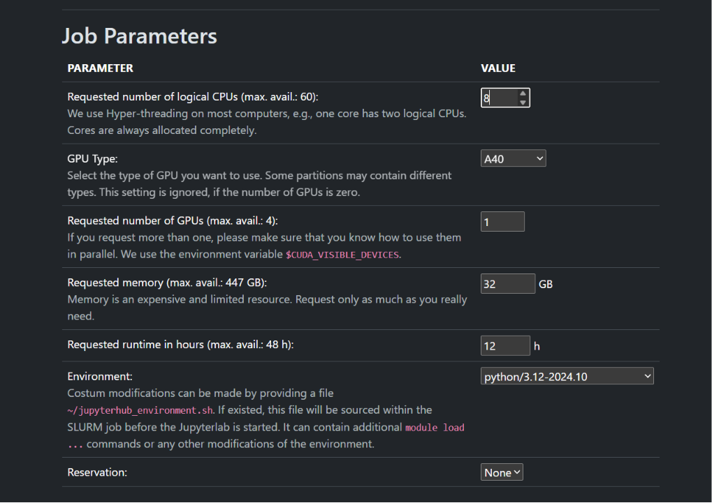

# sam4xtal

Point-prompt SAM3 segmentation for SEM crystal micrographs.

Stack:

- **Next.js + shadcn** UI — load images, click crystals, measure size, save annotations
- **Python sidecar** — local SAM3 inference HTTP API aligned with [Roboflow Inference SAM3](https://inference.roboflow.com/foundation/sam3/)
- **Vercel eve stub** — inert `agent/` scaffold for future agent workflows

## Quick start

### 1. Python sidecar (port 9001)

```bash
cd sidecar
# macOS/Linux
chmod +x run.sh && ./run.sh          # real SAM (transformers + CUDA)
./run.sh --mock                      # flood-fill stub
# Windows
.\run.ps1                            # real SAM
.\run.ps1 --mock                     # stub
```

Default is SAM 3 Tracker via Hugging Face (`facebook/sam3`, point/box PVS). Pass `--mock` for a no-weights flood-fill stub. The model is gated — accept the license on Hugging Face and set `HF_TOKEN` in `sidecar/.env` if download fails.

Mask cleanup (on by default) keeps a single connected region per object: morphological open to cut thin bridges, then the largest connected component. Override in `sidecar/.env`:

```bash
# SAM3_MASK_CLEANUP=1   # 0/false to disable
# SAM3_MASK_OPEN_K=5    # odd open kernel; 0 = largest-CC only (no morphological open)
```

### 2. Next.js app

```bash
cd web
cp .env.example .env.local
pnpm install --config.minimumReleaseAge=0   # if packages are newer than the age policy
pnpm approve-builds --all                   # allow sharp / native postinstalls
pnpm dev
```

Open http://localhost:3000

### Docker (LAN) + systemd user service

Build and run with Compose (GPU sidecar; mounts `~/.cache/huggingface` for HF auth/weights):

```bash
docker compose up -d --build
# UI: http://<host-lan-ip>:3000
```

Register as a systemd user service (enable at boot; does not start/replace running containers unless you pass `--start`):

```bash
chmod +x scripts/install-user-service.sh
./scripts/install-user-service.sh          # install + enable
./scripts/install-user-service.sh --start  # also start (compose --no-recreate)
./scripts/install-user-service.sh --status
systemctl --user stop sam4xtal             # docker compose stop
```

### Sample SEM images

`samples/crystals/` has single-panel SEM crops cut from arXiv `2607.07877v1` for testing the UI. Full multi-panel figures are in `samples/figures/`. Good starters: `fig02_A`, `fig03_A`, `fig04_A`, `fig04_D`.

### 3. Workflow

1. Choose image files
2. Optionally enter SEM resolution in **nm / px** per image (auto-filled from Zeiss/FEI TIFF metadata when present; written into `.mask.json` as `nmPerPx` / `nmPerPxSource`)
3. Click a crystal (positive points); use Negative for refinements
4. **Segment active** for the selected instance, or **Segment all** to run every prompted instance in one request
5. **New** adds another instance on the same image (color-coded overlays); select an instance in the list to edit it
6. Review size for the active instance (and total masked area when several are ready)
7. **Save annotation** → downloads `<image>.mask.json` (per-instance metadata including each instance’s RGB/`hex` color) and `<image>.mask.png` (colormap RGB mask: black background; each instance painted a distinct colormap color so downstream can filter pixels by `instances[].color`)

## Swapping the sidecar for Roboflow

The Next.js proxy at `/api/sam3/*` forwards to whatever `INFERENCE_URL` points at, using the same paths as Roboflow:

| Local sidecar | Roboflow-compatible path |
| --- | --- |
| `POST /sam3/embed_image` | same |
| `POST /sam3/visual_segment` | same |
| `POST /sam3/concept_segment` | same |

To use Roboflow Serverless instead of the local sidecar:

```bash
# web/.env.local
INFERENCE_URL=https://serverless.roboflow.com
ROBOFLOW_API_KEY=your_key
```

Or point at a self-hosted Inference server:

```bash
INFERENCE_URL=http://localhost:9001
```

Request body for interactive clicks (matches Roboflow PVS):

```json
{
  "image": { "type": "base64", "value": "..." },
  "prompts": [
    { "points": [{ "x": 320, "y": 240, "positive": true }] }
  ],
  "multimask_output": false,
  "format": "json"
}
```

### Concept segmentation (few-shot in-image exemplars)

Roboflow-compatible PCS. After the user corrects a few instance masks, send their bboxes as **visual exemplars** on the same image — SAM3 finds every similar instance (`box_labels`: `1` = positive, `0` = negative).

```json
{
  "image": { "type": "base64", "value": "..." },
  "prompts": [
    {
      "type": "visual",
      "boxes": [
        { "x0": 120, "y0": 80, "x1": 220, "y1": 190 },
        { "x": 400, "y": 300, "width": 110, "height": 120 },
        { "x": 50, "y": 50, "width": 40, "height": 30 }
      ],
      "box_labels": [1, 1, 0]
    }
  ],
  "format": "json",
  "output_prob_thresh": 0.5
}
```

Text-only or combined text + exemplars also match Roboflow:

```json
{
  "image": { "type": "base64", "value": "..." },
  "prompts": [
    { "type": "text", "text": "crystal" },
    {
      "type": "visual",
      "text": "particle",
      "boxes": [{ "x": 100, "y": 200, "width": 150, "height": 120 }],
      "box_labels": [1]
    }
  ]
}
```

Saved annotation shape (multi-instance):

```json
{
  "maskEncoding": "instance-colors",
  "backgroundColor": { "r": 0, "g": 0, "b": 0, "hex": "#000000" },
  "instances": [
    {
      "label": 1,
      "color": { "r": 34, "g": 197, "b": 94, "hex": "#22c55e" },
      "measurement": { "areaPx": 1234 }
    }
  ]
}
```

Downstream: load `<image>.mask.png` and keep pixels whose RGB equals `instances[i].color` (or `hex`).
## JupyterHub (faculty / shared Hub)

### Job parameters (spawn form)

These settings are a good default for sam4xtal (real SAM3 + Next.js):

| Parameter | Value | Notes |
| --- | --- | --- |
| Logical CPUs | **4–8** | 4 is enough; 8 is fine (setup/`pnpm build` a bit happier) |
| GPU type | **A40** | Full A40 (~48 GB) is comfortable; avoid tiny MIG slices |
| GPUs | **1** | Do not request more than one |
| Memory | **32 GB** | Host RAM (not VRAM) |
| Runtime | **8–12 h** | Session dies when this ends |
| Environment | **python/3.12-…** | Matches the sidecar (`requires-python = >=3.12`) |
| Reservation | **None** | Unless your group has one |



### Get the code

Clone **outside `$HOME`** — models + venv need several GB. Prefer `$SCRATCH`, `$WORK`, or node-local **`/scratch-local/User.Name`** (your login name; there is no `$SCRATCH_LOCAL` env var), or any path with free space.

In the JupyterLab terminal (or SSH):

```bash
cd $SCRATCH                              # or: cd $WORK
# or node-local scratch (replace with your login, e.g. jane.doe):
# cd /scratch-local/User.Name
git clone https://github.com/keejkrej/sam4xtal.git
cd sam4xtal
```

**JupyterLab’s file browser only shows `$HOME`.** It will not open `/scratch-local/…` in the GUI. After cloning, symlink the repo into home (this is the normal faculty workaround):

```bash
# from inside the clone, e.g. /scratch-local/User.Name/sam4xtal
ln -sfn "$(pwd)" "$HOME/sam4xtal"
```

Then in the Hub GUI open **`sam4xtal/notebooks/setup.ipynb`** under your home tree (the link).  
Edits and `sam4xtal-runtime/` still live on scratch; home only holds the shortcut.

There is no supported “cd to scratch in the file browser” command — symlink (or clone under `$HOME`, which will blow the quota).

### After the session starts

**Use `notebooks/setup.ipynb`.** Run cells top to bottom — no terminal required (beyond the clone above).

1. Start a Hub session with the job parameters above.
2. Clone the repo (see **Get the code**).
3. Open **`notebooks/setup.ipynb`**.
4. Paste your Hugging Face token (accept the `facebook/sam3` license).
5. Run all cells: creates `notebooks/sam4xtal-runtime/` (venv + HF model cache + logs), starts the sidecar, `pnpm build` + `next start`.
6. The last setup cell prints **which URL/port to open** for the Next.js UI (Hub proxy if available, otherwise SSH tunnel to port **3000**).

No Docker. Node.js ≥ 18 must exist on the Hub image (or via a module). First run downloads several GB into `sam4xtal-runtime/` next to the notebook.

Helpers: `jupyterhub/sam4xtal_hub/` (including `setup_runtime.py`). Optional older notebook UI: `notebooks/jupyterhub_workspace.ipynb`.

## Eve agent (stub)

`web/agent/` contains a minimal eve agent that does nothing useful yet:

- `agent/agent.ts`
- `agent/instructions.md`
- `agent/tools/noop.ts`

## Repo layout

```
sam4xtal/
├── README.md
├── docs/             # Hub screenshots / extra docs
├── jupyterhub/       # Hub scripts + sam4xtal_hub notebook helpers
├── notebooks/        # setup.ipynb + mask_statistics + workspace
├── samples/          # SEM figures + crystal panel crops for testing
├── sidecar/          # FastAPI SAM3 sidecar
│   ├── app/
│   ├── pyproject.toml
│   ├── run.sh
│   └── run.ps1
└── web/              # Next.js + shadcn + eve stub
    ├── agent/
    ├── src/
    └── package.json
```
